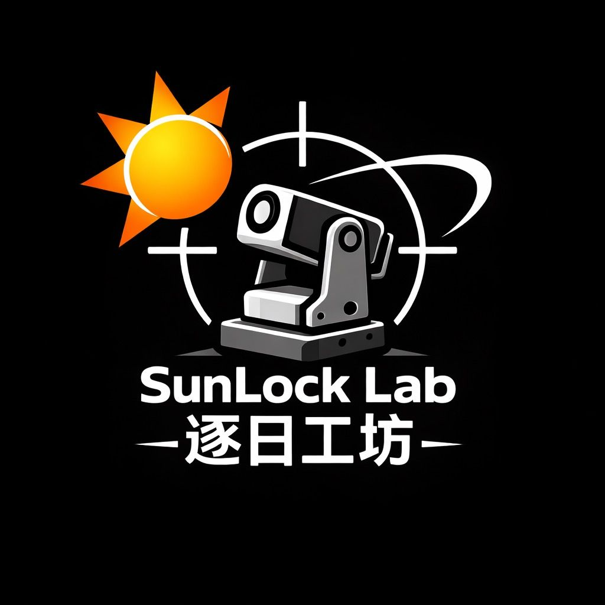
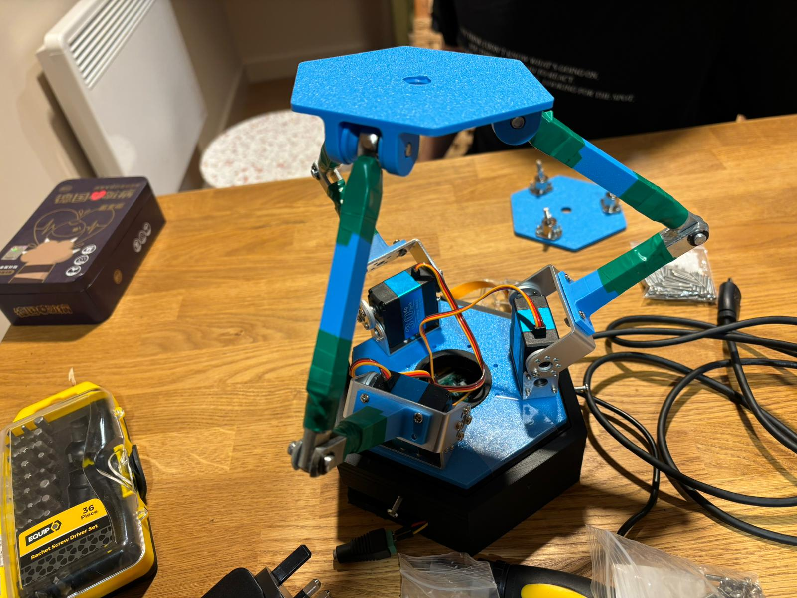
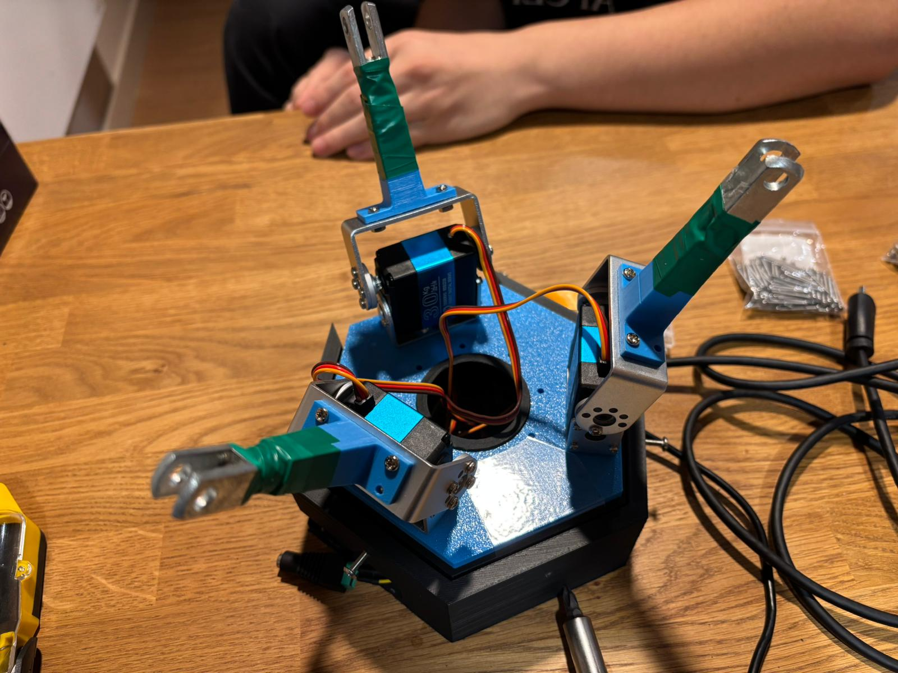
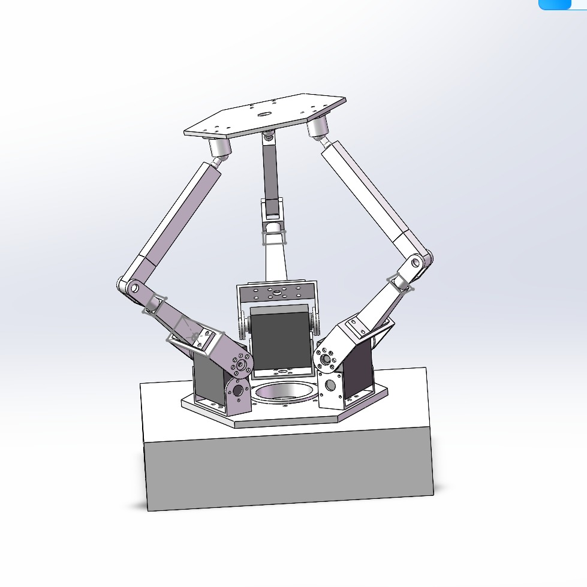
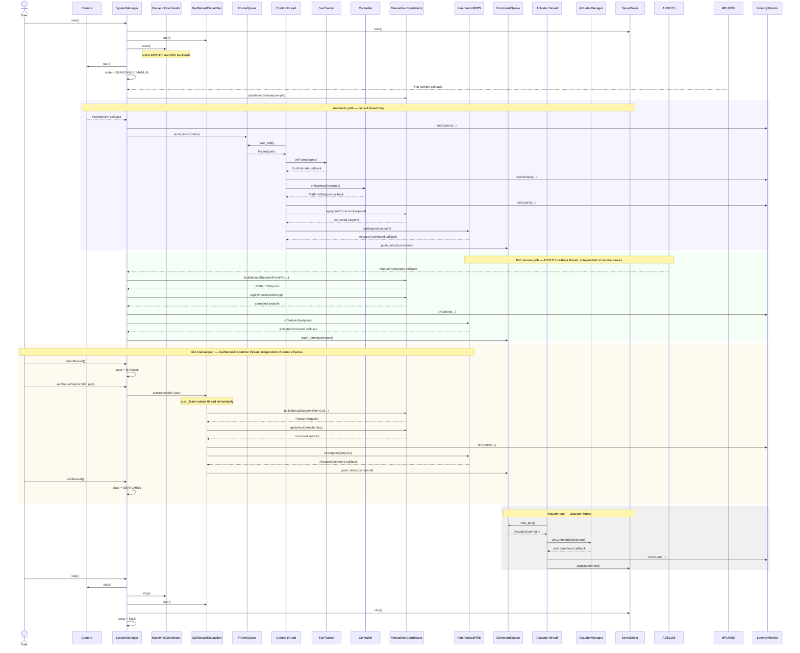
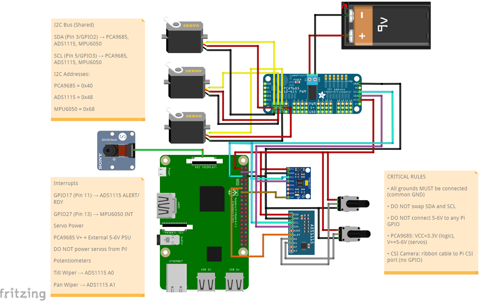

# SunLock Lab Solar Stewart Tracker

<p align="center">
  
</p>

[](https://github.com/Real-Time-Stewart-Solar-Tracker/Solar-Stewart-Tracker/actions/workflows/ci.yml)
[](LICENSE)
[](https://github.com/Real-Time-Stewart-Solar-Tracker/Solar-Stewart-Tracker/releases)

Real-time embedded **C++17** software for solar tracking using a **3-RRS Stewart-type parallel mechanism** on **Raspberry Pi / Linux**.

This project implements an event-driven pipeline in which camera frames are delivered through callbacks, processed by vision and control modules, converted into platform motion through inverse kinematics, and safely applied to three actuators through a hardware abstraction layer. The runtime is structured around blocking waits, callback-driven stage transitions, bounded queues, and modular components so the software remains responsive, maintainable, testable, and reproducible.

<p align="center">
  
</p>
<p align="center">
  
</p>
<p align="center">
  
</p>

### Demo

A short demonstration of the tracker running on hardware is available in the repository root:
https://www.youtube.com/shorts/J-tgFS92vjE
[`Demo Solar Tracker.mp4`](Demo%20Solar%20Tracker.mp4)

---

<p align="center">
  <strong>Explore the full generated developer reference, architecture pages, and API documentation.</strong><br>
  📘 <a href="https://real-time-stewart-solar-tracker.github.io/Solar-Stewart-Tracker/">
    Doxygen Documentation
  </a>
</p>

---

## Table of Contents

- [Social Media](#social-media)
- [Project Overview](#project-overview)
- [Project Management](#project-management)
- [Key Features](#key-features)
- [System Architecture](#system-architecture)
- [Threading and Event Model](#threading-and-event-model)
- [Sequence Diagram](#sequence-diagram)
- [Circuit Diagram](#circuit-diagram)
- [Repository Structure](#repository-structure)
- [Bill of Materials](#bill-of-materials)
- [Dependencies](#dependencies)
- [Cloning](#cloning)
- [Building](#building)
- [Running](#running)
- [Running Tests](#running-tests)
- [Realtime Evidence](#realtime-evidence)
- [Documentation](#documentation)
- [Authors and Contributions](#authors-and-contributions)
- [Acknowledgements](#acknowledgements)
- [License](#license)
- [Future Work](#future-work)
- [Last Updated](#last-updated)

---

## Social Media

We actively document the development, testing, and realtime performance of the **Solar Stewart Tracker**.

The project is documented and published across the following platforms.

📌 **TikTok** — realtime tracking demos, hardware setup, and development clips\
https://www.tiktok.com/@sunlock.lab_2

📌 **Hackster.io** — full project write-up, hardware overview, and build guide\
https://www.hackster.io/fadihalteh21/real-time-solar-stewart-tracker-8ed4bb

Content includes:

- realtime tracking demonstrations
- hardware setup and wiring
- development progress updates
- testing and debugging clips

---

## Project Overview

The **Solar Stewart Tracker** is a Linux userspace realtime embedded system that:

- acquires camera frames from a camera backend
- detects the sun position using image processing
- computes tracking corrections
- converts desired motion into **3-RRS inverse kinematics**
- applies safety shaping before actuation
- drives three servo outputs through a PCA9685 PWM controller

The design goal is not only functional tracking, but tracking implemented in a way that is:

- **event-driven**
- **responsive**
- **modular**
- **testable**
- **reproducible**
- **safe for hardware control**

The main software path is:

**Camera → SunTracker → Controller → ManualImuCoordinator → Kinematics3RRS → ActuatorManager → ServoDriver**

For a detailed overview, see [docs/project_overview.md](docs/project_overview.md).

---

## Project Management

Development was organised through GitHub Milestones, Issues, Pull Requests, and tagged Releases:

- [Milestones](https://github.com/Real-Time-Stewart-Solar-Tracker/Solar-Stewart-Tracker/milestones?state=closed)
- [Issues](https://github.com/Real-Time-Stewart-Solar-Tracker/Solar-Stewart-Tracker/issues?q=is%3Aissue+state%3Aclosed)
- [Pull Requests](https://github.com/Real-Time-Stewart-Solar-Tracker/Solar-Stewart-Tracker/pulls?q=is%3Apr+is%3Aclosed)
- [Releases](https://github.com/Real-Time-Stewart-Solar-Tracker/Solar-Stewart-Tracker/releases)

---

## Key Features

- **Realtime event-driven processing**
  - callback-based frame delivery
  - blocking worker threads
  - no busy-wait control loop in the processing pipeline
  - no sleep-based timing in the control path

- **Modular C++17 architecture**
  - `SystemManager` orchestrates the runtime pipeline
  - hardware-facing and processing modules are separated by clear interfaces
  - optional backends and UI layers do not change the core architecture

- **Multiple build and use modes**
  - Linux / Raspberry Pi execution
  - software-only path with simulated camera input
  - headless CLI application
  - Qt GUI target

- **Safety-oriented actuation path**
  - actuator clamping
  - optional slew/rate limiting
  - neutral / park behaviour on start and stop
  - explicit handling of low-confidence tracking conditions
  - fault-driven suppression of invalid actuation commands

- **Engineering evidence built into the repository**
  - CMake-based build
  - CTest-integrated automated tests
  - latency measurement exported to artefacts
  - Doxygen-ready source tree
  - structured repository layout by subsystem

For class design rationale, see [docs/solid_justification.md](docs/solid_justification.md).
For requirements, see [docs/requirements.md](docs/requirements.md).

---

## System Architecture

<p align="center">
  
</p>

The repository is organised around a staged runtime pipeline.

### Core Modules

- **ICamera** — abstract camera interface used by the system.
- **LibcameraPublisher** — standalone direct libcamera backend implementing `ICamera`. Available as an alternative to the libcamera2opencv-based adapter assembled in `SystemFactory`.
- **SimulatedPublisher** — fallback or simulation camera backend.
- **SystemManager** — top-level orchestrator for state, queues, callbacks, and worker threads.
- **SunTracker** — vision module that finds the bright target and estimates sun position.
- **Controller** — converts tracking error into platform tilt/pan setpoints.
- **ManualImuCoordinator** — coordinates manual input ownership and optional IMU-based correction.
- **Kinematics3RRS** — converts platform setpoints into actuator-space commands.
- **ActuatorManager** — safety shaping layer for command limiting.
- **ServoDriver** — final actuator output layer.
- **LatencyMonitor** — measures timing across the userspace pipeline.

### Queue Policy

Inter-stage communication uses bounded queues with a freshest-data policy:

- **frame queue capacity:** 2
- **command queue capacity:** 8

Both queues use `push_latest(...)`. When a queue is full, the oldest item is discarded before the newest item is inserted. This bounds memory use, prevents unbounded backlog, and keeps the control path biased toward current data rather than stale queued work.

For detailed architecture, callback map, and blocking I/O map, see [docs/system_architecture.md](docs/system_architecture.md).
For the runtime state machine, see [docs/state_machine.md](docs/state_machine.md).

---

## Threading and Event Model

| Thread | Responsibility | Blocking Wakeup Source |
|---|---|---|
| Camera worker | Frame acquisition | timerfd + poll() (simulated) · libcamera callback (hardware) |
| Control worker | Vision + control (automatic only) | frame_q\_ condition_variable wait |
| Actuator worker | Safety conditioning + servo output | cmd_q\_ condition_variable wait |
| GuiManualDispatcher | GUI manual setpoint dispatch | GuiManualDispatcher queue condition_variable wait |
| ADS1115 GPIO callback | Pot sample read + dispatch | ALERT/RDY GPIO edge (libgpiod) |
| MPU6050 GPIO callback | IMU sample read + forward | Data-ready GPIO edge (libgpiod) |
| Main thread | App lifecycle, CLI, signals | poll() on signalfd / timerfd / stdin |

Every thread blocks on a blocking primitive (poll, condition_variable, or GPIO edge wait) and wakes only when an external event occurs. No thread uses polling loops or sleep-based timing anywhere in the codebase.

For the full callback map, blocking I/O map, and realtime execution model, see [docs/system_architecture.md](docs/system_architecture.md) and [docs/realtime_analysis.md](docs/realtime_analysis.md).

---

## Sequence Diagram



---

## Circuit Diagram

<p align="center">
  
</p>

The hardware setup connects:

- camera through a libcamera-compatible interface
- PCA9685 PWM driver over I2C
- ADS1115 over I2C for manual input
- MPU6050 over I2C for feedback
- three servo motors
- Raspberry Pi acting as the central controller

The PCA9685 generates PWM signals for the servos, while I2C provides communication between the Raspberry Pi, the manual-input ADC, the IMU, and the actuator driver layer.

For exact pin-level connections, see [docs/hardware_connections.md](docs/hardware_connections.md).
The editable Fritzing source file is available at [`diagrams/circuit_diagram.fzz`](diagrams/circuit_diagram.fzz).

---

## Repository Structure

```text
Solar-Stewart-Tracker/
├── .github/
│   └── workflows/
├── artefacts/
├── external/
│   ├── libcamera2opencv/
│   └── libgpiod_event_demo/
├── scripts/
├── src/
│   ├── actuators/
│   │   └── tests/
│   ├── app/
│   ├── common/
│   │   └── tests/
│   ├── control/
│   │   └── tests/
│   ├── hal/
│   │   └── tests/
│   ├── qt/
│   ├── sensors/
│   │   └── tests/
│   ├── system/
│   │   └── tests/
│   ├── tests/
│   │   └── support/
│   └── vision/
│       └── tests/
├── CMakeLists.txt
├── CONTRIBUTING.md
├── Doxyfile
└── LICENSE
```

---

## Bill of Materials

### Controller

| Component | Quantity | Cost (£) |
|---|---:|---:|
| Raspberry Pi 5 (8GB) | 1 | 80.00 |

### Sensors and Vision

| Component | Quantity | Cost (£) |
|---|---:|---:|
| IMX219 Camera Module | 1 | 25.00 |

### Actuation and Drive

| Component | Quantity | Cost (£) |
|---|---:|---:|
| PCA9685 PWM Driver | 1 | 12.00 |
| High-Torque Servo (RDS3230 or equivalent) | 3 | 45.00 |
| External 5–6V High-Current Supply | 1 | 20.00 |

### Mechanical and Supporting Components

| Component | Quantity | Cost (£) |
|---|---:|---:|
| Breadboard and Wiring Set | 1 | 10.00 |
| Structural Frame / 3D Printed Parts | 1 | 15.00 |
| Fasteners and Mounts | Assorted | 10.00 |

**Grand Total: £217.00**

For a detailed bill of materials, see [docs/BOM.md](docs/BOM.md).

---

## Dependencies

The following packages are required on Raspberry Pi OS (Debian Trixie, 64-bit):

```bash
sudo apt update
sudo apt install -y build-essential cmake git pkg-config ninja-build
sudo apt install -y libcamera-dev libopencv-dev libturbojpeg0-dev libgpiod-dev
sudo apt install -y qtbase5-dev qtcharts5-dev qt5-qmake
sudo apt install -y doxygen graphviz
```

For a complete dependency reference, see [docs/DEPENDENCIES.md](docs/DEPENDENCIES.md).

---

## Cloning

```bash
git clone --recurse-submodules https://github.com/Real-Time-Stewart-Solar-Tracker/Solar-Stewart-Tracker.git
cd Solar-Stewart-Tracker
```

If you already cloned without submodules:

```bash
git submodule update --init --recursive
```

> **Note:** The GitHub auto-generated source ZIP does not include submodule contents. Always clone with `--recurse-submodules`.

### Submodules

This project depends on two external submodules under `external/`:

- [`external/libcamera2opencv`](https://github.com/berndporr/libcamera2opencv) — libcamera to OpenCV bridge for the camera backend
- [`external/libgpiod_event_demo`](https://github.com/berndporr/libgpiod_event_demo) — event-driven GPIO wrapper for ADS1115 and MPU6050 interrupt handling

Both are required for a successful build. If either directory is empty after cloning, run `git submodule update --init --recursive`.

---

## Building

```bash
cmake -S . -B build -G Ninja -DCMAKE_BUILD_TYPE=Release
cmake --build build -j
```

This builds all targets including the CLI application, the Qt GUI, and all tests. No hardware needs to be connected — only the development libraries installed via `apt`.

---

## Running

### Headless CLI

```bash
./build/solar_tracker
```

### Qt GUI (full application with live preview and manual controls)

```bash
./build/src/qt/solar_tracker_qt
```

### Hardware Mode

Hardware execution requires:

- libcamera-compatible camera connected
- I2C enabled on the host
- PCA9685 and servos connected and powered
- external 5–6V servo power supply

The system enters `FAULT` if required hardware is unavailable at startup.

### Runtime Latency Capture

```bash
mkdir -p artefacts
SOLAR_LATENCY_CSV=artefacts/latency.csv ./build/solar_tracker
```

Type `quit` and press Enter to stop cleanly. Latency data is written to `artefacts/latency.csv` on shutdown.

For reproducibility steps and environment setup, see [docs/REPRODUCIBILITY.md](docs/REPRODUCIBILITY.md).

---

## Running Tests

```bash
ctest --test-dir build --output-on-failure
```

Or via the convenience script:

```bash
./scripts/test_core.sh
```

### Included Automated Test Areas

- SunTracker
- Controller
- ManualInputMapper
- ImuFeedbackMapper
- ImuTiltEstimator
- ActuatorManager
- ThreadSafeQueue
- Kinematics3RRS
- LatencyMonitor
- SystemManager state handling
- PCA9685
- ServoDriver
- MPU6050 publisher
- Linux I2C hardware smoke path

For the full testing strategy and test matrix, see [docs/testing.md](docs/testing.md).

---

## Realtime Evidence

Latency was measured on real hardware using the **libcamera2opencv** backend (IMX219 CSI sensor, 640×480, RGB888, 30 fps) on a Raspberry Pi 5. Frame-interval analysis (standard deviation 4.46 ms) confirms the measurements reflect genuine camera sensor timing, not synthetic simulation.

The measured software-side pipeline is:

**Camera → FrameQueue → SunTracker → Controller → ManualImuCoordinator → Kinematics3RRS → ActuatorManager → ServoDriver**

All measurements are taken using monotonic timestamps recorded inside the software pipeline and exported to `artefacts/latency.csv`.

### Latency Results (1367 frames, 46.6 seconds)

| Metric | Average (ms) | Minimum (ms) | Maximum (ms) | Jitter (ms) |
|---|---:|---:|---:|---:|
| L_total | 2.397656 | 1.869860 | 4.553350 | 2.683490 |
| L_vision | 2.379005 | 1.859520 | 4.531040 | 2.671520 |
| L_control | 0.001495 | 0.000500 | 0.070347 | 0.069847 |
| L_actuation | 0.017155 | 0.008648 | 0.156285 | 0.147637 |

### Interpretation

- average end-to-end software latency is approximately **2.40 ms**
- worst-case measured software latency is approximately **4.55 ms**
- processing uses approximately **7.3%** of a 30 Hz frame period (33 ms)
- measurements represent the userspace software path only, not full physical actuator motion or mechanical settling time

For detailed latency analysis, design decisions informed by measurements, and frame-interval evidence, see [docs/latency_measurement.md](docs/latency_measurement.md).
For the realtime execution model and event-driven architecture, see [docs/realtime_analysis.md](docs/realtime_analysis.md).

---

## Documentation

### Doxygen API Reference

The generated developer reference is hosted online:

https://real-time-stewart-solar-tracker.github.io/Solar-Stewart-Tracker/

To generate locally:

```bash
doxygen Doxyfile
```

Open at `docs/html/index.html`.

### Source Areas Covered

- `src/actuators`
- `src/app`
- `src/common`
- `src/control`
- `src/hal`
- `src/sensors`
- `src/system`
- `src/vision`
- `src/qt`

### Project Documentation

| Document | Description |
|---|---|
| [docs/project_overview.md](docs/project_overview.md) | Project summary |
| [docs/system_architecture.md](docs/system_architecture.md) | Architecture, callback map, blocking I/O map |
| [docs/state_machine.md](docs/state_machine.md) | Runtime state machine |
| [docs/realtime_analysis.md](docs/realtime_analysis.md) | Realtime execution model |
| [docs/latency_measurement.md](docs/latency_measurement.md) | Quantitative latency evidence |
| [docs/testing.md](docs/testing.md) | Testing strategy and test matrix |
| [docs/solid_justification.md](docs/solid_justification.md) | SOLID class design rationale |
| [docs/requirements.md](docs/requirements.md) | Functional and non-functional requirements |
| [docs/user_stories_use_cases.md](docs/user_stories_use_cases.md) | User stories and use cases |
| [docs/DEPENDENCIES.md](docs/DEPENDENCIES.md) | Dependency reference |
| [docs/REPRODUCIBILITY.md](docs/REPRODUCIBILITY.md) | Reproducibility guide |
| [docs/build_and_run.md](docs/build_and_run.md) | Build and run reference |
| [docs/hardware_connections.md](docs/hardware_connections.md) | Pin-level wiring reference |
| [docs/BOM.md](docs/BOM.md) | Bill of materials |

---

## Authors and Contributions

**Fadi Halteh (3127931H)**
Designed and implemented the event-driven system architecture, including runtime orchestration, state handling, and the bounded queue pipeline. Responsible for integrating the major software stages into the full runtime path. Implemented the MPU6050 (IMU) and ADS1115 (manual input) integration within the system, including their event-driven data handling and coordination with the control pipeline. Also responsible for the system architecture design and creation of the technical diagrams (pipeline, threading, and system architecture).

**Jichao Wang (3137140W)**
Developed the 3-RRS inverse kinematics model and core application setup, including configuration, factory creation, and application entry structure. Responsible for translating platform setpoints into actuator-space commands.

**Ziming Yan (2429452Y)**
Developed the vision subsystem and user interface components, including the SunTracker detection pipeline and Qt-based control panel. Integrated visual feedback, overlays, and runtime interaction into the system.

**Tareq A M Almzanin (3139787A)**
Implemented the control layer translating vision estimates into platform motion, including closed-loop control logic and manual override behaviour. Contributed to the definition of shared data types and the control-side software path.

**Zhenyu Zhu (3099498Z)**
Implemented the low-level actuator interface including PCA9685 integration and servo control, along with latency measurement instrumentation. Responsible for hardware abstraction and timing analysis across the system pipeline.

---

## Acknowledgements

We would like to thank:

- Dr. Bernd Porr for guidance in realtime embedded systems and architecture design
- Dr. Chongfeng Wei for software engineering support and project supervision
- the University of Glasgow
- the laboratory, workshop, and technical support staff involved in supporting the project

Their guidance and infrastructure helped shape both the realtime architecture and the engineering process behind this repository.

---

## License

This project is released under the [MIT License](LICENSE).

### External Components and Attribution

The repository also includes or depends on external open-source components. Please credit and use them according to their original licenses.

- **libcamera2opencv** — https://github.com/berndporr/libcamera2opencv
- **libgpiod_event_demo** — https://github.com/berndporr/libgpiod_event_demo

---

## Future Work

Planned or natural next extensions include:

- richer telemetry and live plotting
- enhanced fault handling and recovery strategies
- broader hardware-backed integration testing
- further public-facing project media and demonstration material

---

## Last Updated

April 2026