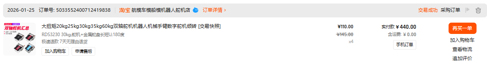
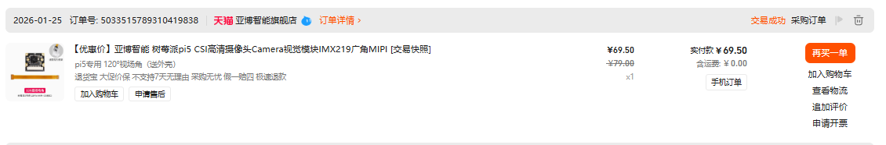
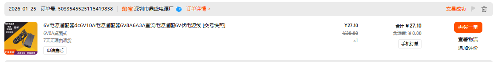
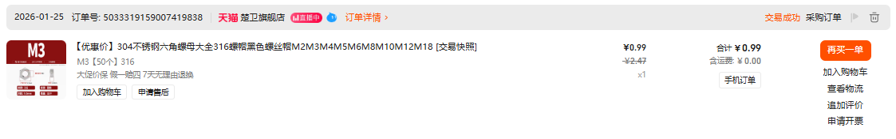
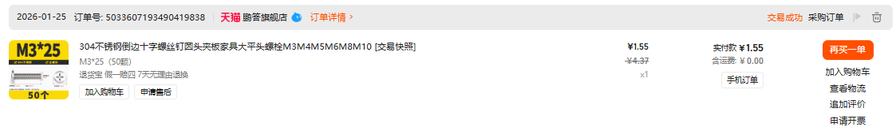
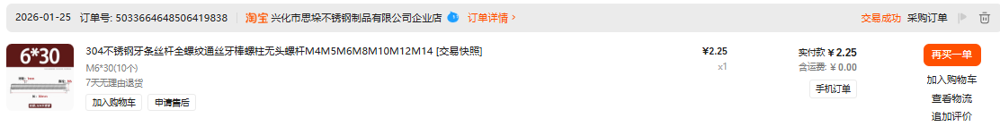

# Bill of Materials (BOM) | 物料清单

> Product image appendix for the mechanical model branch.
> 机械模型分支的商品图附录。

---

### Product Images | 商品图

#### Actuation | 执行机构

- `RDS3230 30kg` dual-axis digital servo, used as the three primary actuators of the 3RRS platform.

#### Driver | 驱动模块

- `PCA9685A` 16-channel `PWM` servo driver board, connected to the main controller via `I2C` to provide stable multi-channel servo control signals.

#### Vision | 视觉感知

- `IMX219` Raspberry Pi `Pi 5` camera module with `CSI/MIPI` interface and `120-degree` wide-angle lens, used for light-source target tracking.

#### Power Supply | 供电系统

- `6V 8A` DC power adapter, used as the main servo-side power supply to maintain voltage stability during simultaneous multi-servo motion.
#### Rotary Joint | 转动副

- `Y-type joint` and `SC standard connector` set (`M6x1`), used as the intermediate rotary joint assembly of the 3RRS mechanism.

#### S-Joint Alternative | S关节替代

- `XUDZ SA6T/K` rod end ball joint, used as an alternative intermediate joint solution to maintain accurate single-DOF rotation.

#### Fasteners | 紧固硬件

- `M2x20` cross-head pan screw, used for small attachments and local structural fastening.

- `M3` stainless steel hex nut, used for servo brackets, connection plates, and thin-plate structural locking.

- `M3x30` fastener, used for light-load connections, link-end installation, and local leveling adjustment.

- `M3x25` flat-head / countersunk screw, used where a flush mounting surface is required.

- `M6x30` stainless steel fully threaded rod, suitable for load-bearing connections and larger-structure adjustment.

- `M6x35` double-end threaded rod / extended stud, used for connector joining and installation-length fine adjustment.

#### Connectivity | 接口线材

- Raspberry Pi `Pi 5` `CSI/DSI FPC` flex cable, used for high-speed signal connection between the camera and the main controller.

- `5.5x2.5mm` `DC` power adapter plug / jack, used for external power input and cable conversion.

---

### Notes | 备注

- All quantities are for one complete 3RRS unit.
- 所有数量均为一套完整 3RRS 单元所需。
- Fastener quantities may vary based on assembly design.
- 紧固件数量可能根据装配设计有所变化。

