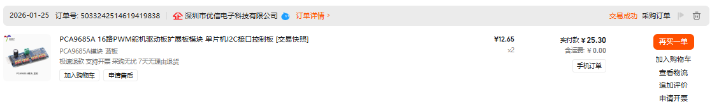
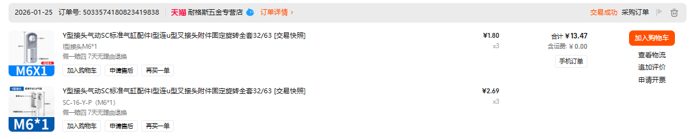
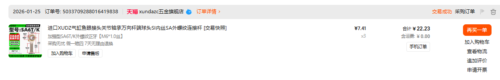
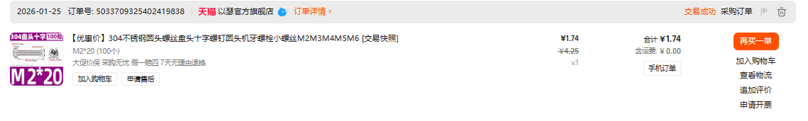
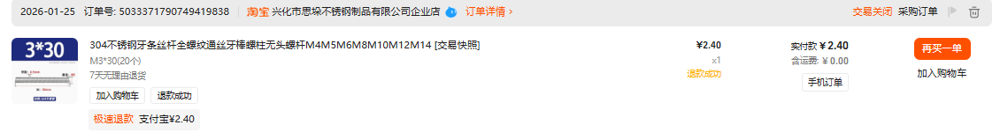
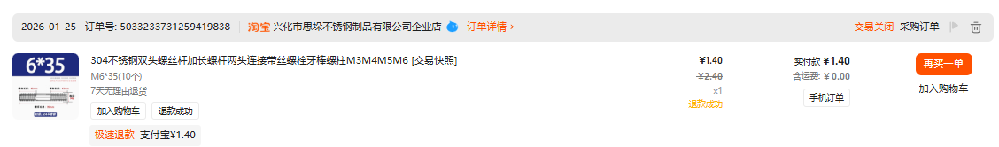
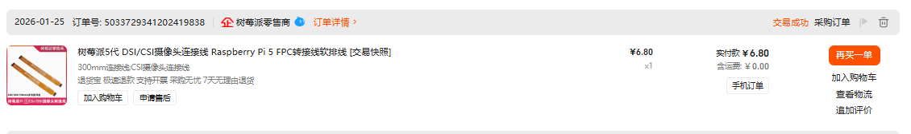
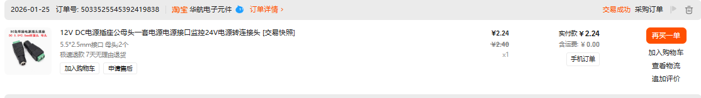

# Bill of Materials (BOM) | 物料清单

[English](#english) | [中文](#中文)

---

## English

### 3RRS Solar Stewart Tracker - Component List

| Category | Component | Specifications | Qty | Key Function |
|----------|-----------|----------------|-----|--------------|
| **Computation** | Raspberry Pi 5 | 4GB RAM Version | 1 | Core brain running 50Hz real-time IK solver |
| **Actuation** | Digital Servo | RDS3230 (30kg/Dual-axis) | 3 | High-torque actuators for 3RRS parallel platform |
| **Driver** | PWM Driver Board | PCA9685 (16-Channel I2C) | 1 | Hardware PWM expansion to ensure real-time control |
| **Vision** | Camera Module | IMX219 (120° FOV/CSI) | 1 | Centroid extraction for active vision closed-loop |
| **Power Supply** | DC Power Adapter | 6V 8A (Industrial Grade) | 1 | Prevents voltage sags during simultaneous high-torque movements |
| **Rotary Joint** | Y-Clevis / I-Joint | SC Standard (M6/Rotary) | 3 sets | Intermediate revolute joint for 3RRS, ensuring precise single-DOF rotation |
| **S-Joint Alt.** | Rod End Ball Joint (Fish-eye) | XUDZ SA6T/K (M6×1.02 thread) | 3 | Intermediate revolute joint for 3RRS, ensuring precise single-DOF rotation |
| **Fasteners** | SS Bolts & Nuts | M2, M3, M6 Assorted | N/A | High-strength assembly for overall structural reliability |
| **Connectivity** | DC Jack & FPC Cable | 5.5mm Jack / 300mm FPC | 1 ea. | Reliable power input and high-speed data link for Pi 5 |

---

## 中文

### 3RRS 太阳能 Stewart 追踪器 - 组件清单

| 类别 | 组件名称 | 规格/型号 | 数量 | 关键用途 |
|------|----------|-----------|------|----------|
| **计算单元** | 树莓派 5 | 4GB RAM 版本 | 1 | 系统大脑，运行 50Hz 实时逆运动学解算 |
| **执行机构** | 数字舵机 | RDS3230 (30kg/双轴) | 3 | 3RRS 平台的动力源，提供高刚度动态输出 |
| **驱动模块** | 舵机驱动板 | PCA9685 (16路/I2C接口) | 1 | 硬件级 PWM 扩展，保障控制信号的实时稳定性 |
| **视觉感知** | 高清摄像头 | IMX219 (120°广角/CSI) | 1 | 实时捕获光源质心，实现主动视觉闭环追踪 |
| **供电系统** | DC 电源适配器 | 6V 8A (工业级稳压) | 1 | 为舵机群提供稳健电流，消除高频动作下的电压跌落 |
| **转动副** | Y型/I型接头全套 | SC标准件 (M6/固定旋转) | 3套 | 作为 3RRS 机构的中间转动关节，确保精确的单自由度旋转 |
| **S关节替代** | 鱼眼关节 | XUDZ SA6T/K (M6×1.02丝) | 3 | 作为 3RRS 机构的中间转动关节，确保精确的单自由度旋转 |
| **紧固硬件** | 不锈钢螺丝/螺母 | M2, M3, M6 (多种规格) | 若干 | 全系统高强度机械组装，确保持久结构稳定性 |
| **接口线材** | DC转接/FPC线 | 5.5mm 母头 / 300mm 排线 | 各 1 | 解决电源引入与树莓派 5 的长距离视觉传输 |

---
### Product Images | 商品图

#### Actuation | 执行机构

- `RDS3230 30kg` dual-axis digital servo, used as the three primary actuators of the 3RRS platform.

#### Driver | 驱动模块

- `PCA9685A` 16-channel `PWM` servo driver board, connected to the main controller via `I2C` to provide stable multi-channel servo control signals.

#### Vision | 视觉感知

- `IMX219` Raspberry Pi `Pi 5` camera module with `CSI/MIPI` interface and `120-degree` wide-angle lens, used for light-source target tracking.

#### Power Supply | 供电系统

- `6V 8A` DC power adapter, used as the main servo-side power supply to maintain voltage stability during simultaneous multi-servo motion.

#### Rotary Joint | 转动副

- `Y-type joint` and `SC standard connector` set (`M6x1`), used as the intermediate rotary joint assembly of the 3RRS mechanism.

#### S-Joint Alternative | S关节替代

- `XUDZ SA6T/K` rod end ball joint, used as an alternative intermediate joint solution to maintain accurate single-DOF rotation.

#### Fasteners | 紧固硬件

- `M2x20` cross-head pan screw, used for small attachments and local structural fastening.

- `M3` stainless steel hex nut, used for servo brackets, connection plates, and thin-plate structural locking.

- `M3x30` fastener, used for light-load connections, link-end installation, and local leveling adjustment.

- `M3x25` flat-head / countersunk screw, used where a flush mounting surface is required.

- `M6x30` stainless steel fully threaded rod, suitable for load-bearing connections and larger-structure adjustment.

- `M6x35` double-end threaded rod / extended stud, used for connector joining and installation-length fine adjustment.

#### Connectivity | 接口线材

- Raspberry Pi `Pi 5` `CSI/DSI FPC` flex cable, used for high-speed signal connection between the camera and the main controller.

- `5.5x2.5mm` `DC` power adapter plug / jack, used for external power input and cable conversion.

---

### Notes | 备注

- All quantities are for one complete 3RRS unit.
- 所有数量均为一套完整 3RRS 单元所需。
- Fastener quantities may vary based on assembly design.
- 紧固件数量可能根据装配设计有所变化。

